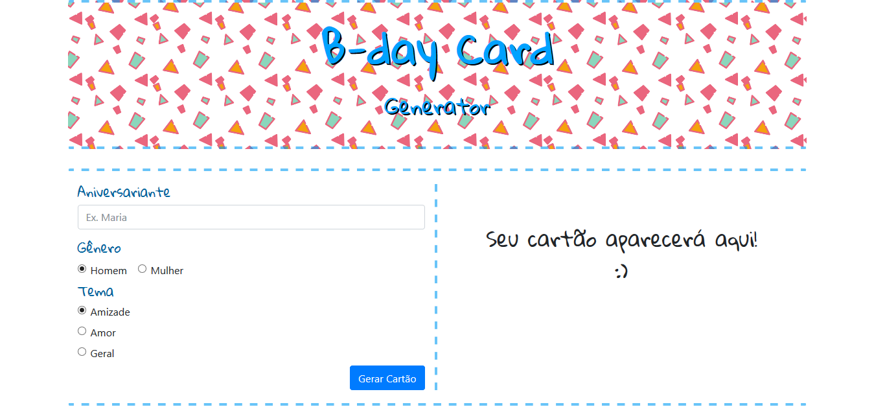
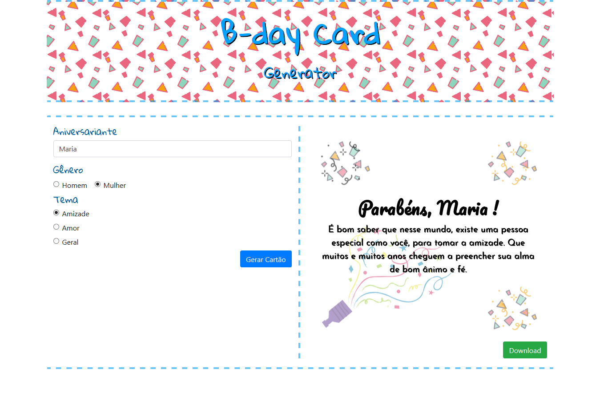

# B-day Card Generator
Gerador de Cartões de Aniversário

## Tecnologias utilizadas
* HTML5
* CSS3
* Bootstrap4
* jQuery
* HTML2Canvas
* PHP

## Screenshots

    

    

## License
MIT - Copyright (c) 2018 Letícia Fernandes

### Mensagens - Fonte:
https://www.mensagemaniversario.com.br/